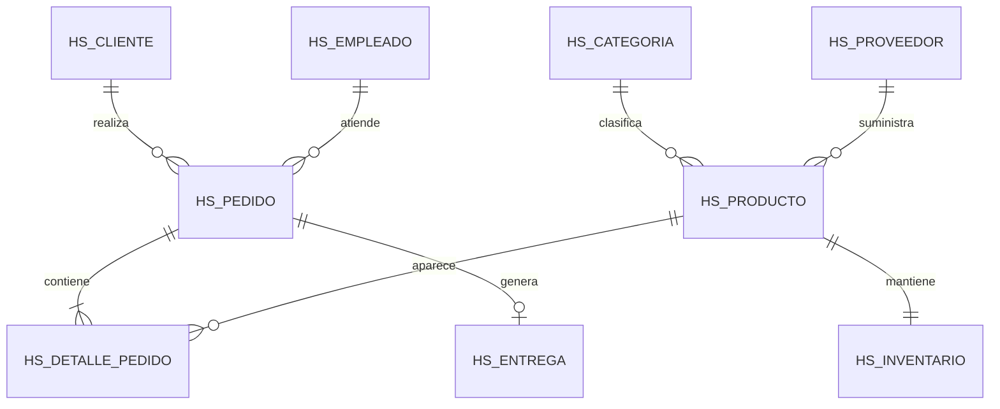

# Oracle Business Database

Relational database project for managing customers, suppliers, products, inventory, employees, orders and deliveries. It demonstrates Oracle SQL modeling, integrity constraints, transactions and business reporting.

## Highlights

- Nine normalized business entities
- Primary, foreign, unique and check constraints
- Identity columns and sequence-independent inserts
- Sample data for immediate execution
- Analytical queries for sales, inventory and customers
- Transaction examples with `COMMIT` and `ROLLBACK`
- Indexes for frequent lookup paths

## Data model



## Run order

Execute the scripts with Oracle SQL Developer or SQL*Plus:

```text
1. sql/01_schema.sql
2. sql/02_sample_data.sql
3. sql/03_business_queries.sql
```

## Business questions answered

- Which products are below their minimum stock?
- What are monthly sales totals?
- Who are the highest-value customers?
- Which categories generate the most revenue?
- What is the status of each delivery?

## Skills demonstrated

Oracle SQL, relational modeling, DDL, DML, joins, aggregation, subqueries, constraints, indexes and transactions.

## Author

**Herbert Stuardo Pacheco** — [GitHub](https://github.com/StuardoP) · [LinkedIn](https://linkedin.com/in/stuardopacheco)

